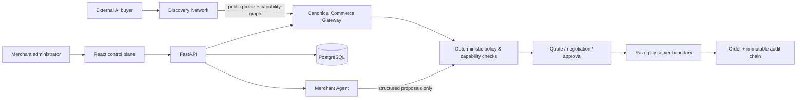
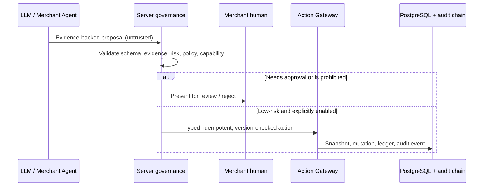
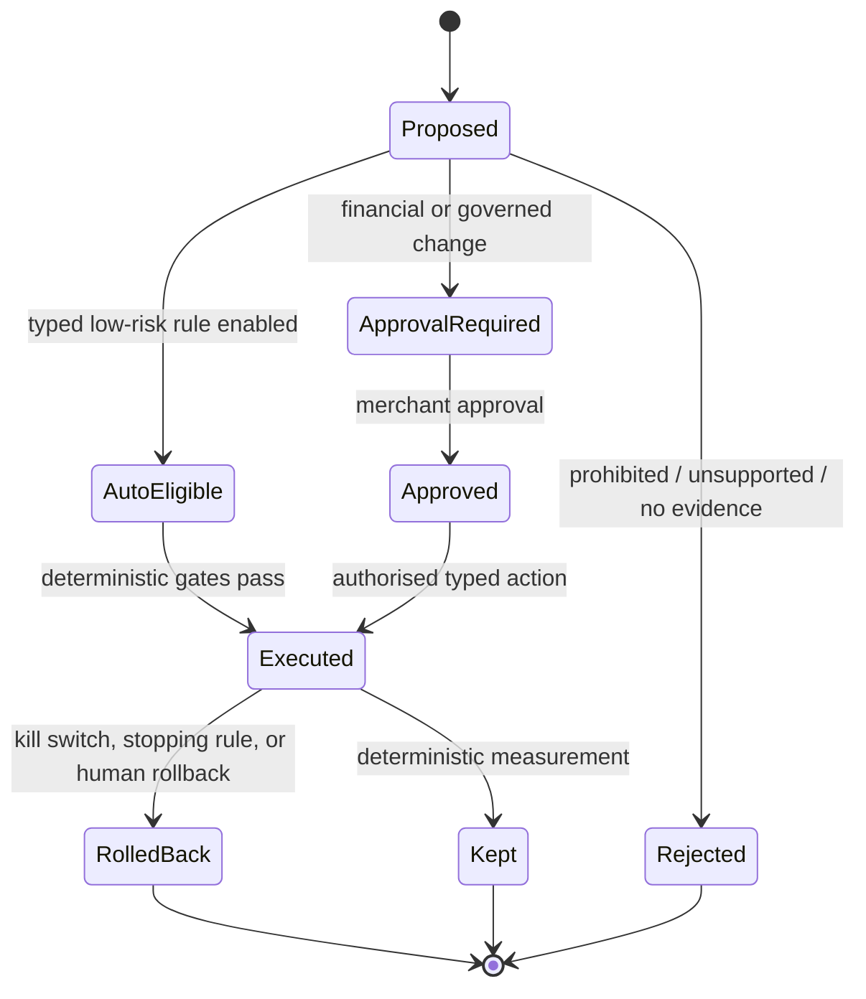

# pimp

**A governed commerce control plane for AI-ready merchants.**

`pimp` lets a merchant expose a machine-readable catalog, negotiate within
deterministic policy, accept buyer-authorized payments, use evidence-backed
merchant intelligence, and—only when a human enables it—apply a small set of
reversible optimizations. It is built around Razorpay test-mode integration,
PostgreSQL, FastAPI, and a React control plane.

> **Core rule:** intelligence is not authority. An LLM can observe and propose;
> deterministic server-side code decides whether anything may happen.

## What it does

- Gives external AI buyers a typed, capability-gated commerce flow: discover →
  quote → negotiate → checkout → payment verification → order.
- Enforces merchant pricing floors, integer-paise money, policy decisions,
  human approval gates, state machines, idempotency, and append-only audits.
- Provides a merchant portal for catalog, inventory, approvals, policies,
  payments, audit history, merchant-agent proposals, experiments, autonomy,
  and public discoverability.
- Exposes public discovery through opaque IDs and safe merchant/product
  summaries. Discovery never reserves stock, creates an order, or authorizes a
  payment.
- Supports a deliberately narrow, kill-switch-controlled autonomy allowlist
  for reversible catalog/discovery improvements—never refunds, payment capture,
  policy changes, pricing changes, or capability changes.

## Architecture



### Authority boundary



### Autonomous action lifecycle



## Safety model

| Boundary | Enforcement |
| --- | --- |
| Money | Non-negative integer paise; merchant floor/margin checks; server-authoritative Razorpay verification. |
| Authority | LLM and browser outputs are untrusted; canonical gateway and policy engine are authoritative. |
| State | Explicit state machines, row locks, optimistic versions, and durable idempotency receipts. |
| Autonomy | Human-configured, typed allowlist; budget/cooldown checks; kill switch; immutable snapshots; idempotent rollback. |
| Tenant isolation | Merchant scope is checked at query/service boundaries and reinforced by composite database constraints. |
| Public discovery | Opaque identifiers, allowlisted fields, no secrets/PII, inventory-aware matching, transaction-time revalidation. |
| Traceability | Consequential events append cryptographically linked audit records. |

## Design trade-offs

This project favors predictable, governable commerce over maximum automation.

| Choice | Why | Trade-off |
| --- | --- | --- |
| LLM proposes; server decides | A model cannot silently change policy, prices, payments, or permissions. | More steps and occasional human review. |
| Narrow reversible autonomy | Rollback can restore a known resource snapshot safely. | No autonomous refunds, discounts, payment operations, or broad catalog changes. |
| Discovery is descriptive | A search result never substitutes for real inventory, price, or payment checks. | Buyers must enter the canonical flow before transacting. |
| Generated buyer token is return-once | Raw credentials are never stored or replayed from durable idempotency records. | A client must retain the original response, supply its own token, or start a new session after loss. |
| Opaque public merchant IDs | Prevents public exposure of internal database identifiers. | Public integrations use a discovery ID instead of a database ID. |
| Bounded analysis and deterministic metrics | Prevents unbounded compute and fabricated outcomes. | The agent can return no new action when evidence, provider output, or samples are inadequate. |

## Repository map

| Path | Purpose |
| --- | --- |
| `src/agent_ready_merchant/main.py` | FastAPI application, public and merchant endpoints, SPA surface. |
| `src/agent_ready_merchant/gateway/` | Canonical, typed commerce capability boundary. |
| `src/agent_ready_merchant/policy/` | Deterministic pricing and governance decisions. |
| `src/agent_ready_merchant/services/` | Payments, merchant portal, agent, autonomy, and discovery services. |
| `src/agent_ready_merchant/models/` | SQLAlchemy domain models. |
| `alembic/versions/` | PostgreSQL schema migrations. |
| `frontend/` | React/Vite merchant control-plane source. |
| `src/agent_ready_merchant/static/` | Compiled SPA served by FastAPI in production. |
| `tests/` | Backend integration, security, concurrency, and regression coverage. |
| `docs/` | Architecture, invariants, decisions, failure model, and phase evidence. |

## Local development

### Prerequisites

- Python 3.11–3.13
- PostgreSQL 16+ (or the configured InsForge Postgres database)
- Node.js 20+ and npm for frontend work
- Razorpay **test-mode** credentials for payment testing

### Configure the backend

```powershell
Copy-Item .env.example .env
# Edit .env: use your database URL, a long random SECRET_KEY, InsForge auth URL,
# Razorpay test credentials, and an LLM provider key/model when agent analysis is needed.

py -m pip install -e ".[dev]"
py -m alembic upgrade head
py -m uvicorn agent_ready_merchant.main:app --host 127.0.0.1 --port 8000 --reload
```

Open `http://127.0.0.1:8000/health` to verify the service. The compiled control
plane is served from `http://127.0.0.1:8000/` when static assets are present.

### Develop the frontend

```powershell
Set-Location frontend
npm install
npm run dev
```

The Vite development server assumes the backend is available on the same
origin/proxy setup used by development. The production application is designed
to serve the compiled SPA from FastAPI as one origin. Hosting the current
frontend separately on Vercel needs an explicit API-base and backend CORS
configuration; that split-origin deployment is not configured in this repo.

## Docker deployment

The included `Dockerfile` installs the application as a normal production
package **and bundles the compiled SPA assets**.

```powershell
docker build -t pimp-api:local .
docker run --rm --env-file .env -e ENVIRONMENT=production -e DEBUG=false `
  -p 8000:8000 pimp-api:local
```

Before production deployment:

1. Run `py -m alembic upgrade head` against the production database.
2. Store `.env` values in the platform’s secret manager—never commit or bake
   them into an image.
3. Use a unique, high-entropy `SECRET_KEY`; production rejects known defaults.
4. Set `DATABASE_URL` and `DATABASE_URL_SYNC` to the same production Postgres
   database in their respective async/sync formats.
5. Configure Razorpay webhooks to the deployed backend and use test mode until
   the integration has been independently verified.
6. Point the platform health check to `/health` and expose container port `8000`.

The service is stateless apart from Postgres. It should be deployed with a
shared production database and migrations applied once per release.

## Quality gate

Run these from the repository root before opening a pull request or deploying:

```powershell
py -m ruff format --check .
py -m ruff check .
py -m mypy src tests
py -m pytest

Set-Location frontend
npm test
npm run build
```

## Documentation

- [Phase status and completion evidence](docs/phase.md)
- [Architecture](docs/architecture.md)
- [Domain model](docs/domain-model.md)
- [Non-negotiable invariants](docs/invariants.md)
- [Architectural decisions](docs/decisions.md)
- [State machines](docs/state-machines.md)
- [Policy model](docs/policy-model.md)
- [Failure model](docs/failure-model.md)
- [Evaluation and test evidence](docs/evaluation.md)
- [Review and deferred hardening log](docs/work_review.md)

## Current scope

Phases 1–9 are complete. Phase 9 is the final authorized implementation phase;
the project intentionally does not implement Phase 10-style signed-agent trust,
reputation networks, advertising, auctions, or broader financial autonomy.
