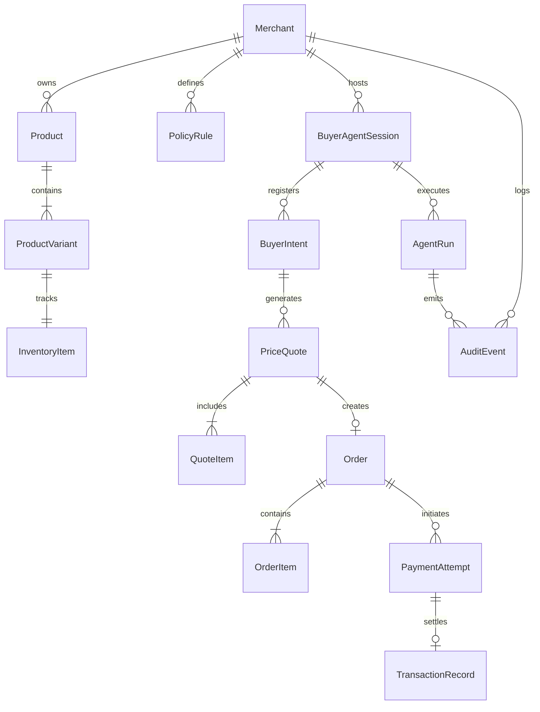

# Canonical Domain Model: Agent-Ready Merchant (Phase 0)

> **Core Principle:** Every financial entity is immutable or append-only. Amounts are stored strictly as 64-bit integer paise (INR). Entity mutations must pass through state-machine transitions and optimistic locking checks.

---

## 1. Entity Relationship Diagram (ERD)

---

## 2. Canonical Entities Specification

### 2.1 Merchant (`merchants`)
Authoritative record of a merchant participating in the Agent-Ready platform.

| Field | Type | Nullable | Description | Authority |
|---|---|---|---|---|
| `id` | `UUID` | No | Primary Key | Platform |
| `name` | `VARCHAR(255)` | No | Merchant business name | Merchant Admin |
| `slug` | `VARCHAR(100)` | No | Unique URL-safe identifier | Merchant Admin |
| `status` | `VARCHAR(32)` | No | `ACTIVE`, `PAUSED`, `SUSPENDED` | Merchant / Platform |
| `currency` | `VARCHAR(3)` | No | ISO 4217 Currency Code (`INR`) | Platform |
| `rzp_key_id` | `VARCHAR(128)` | No | Razorpay Test Key ID (`rzp_test_...`) | Merchant Admin |
| `auth_user_id` | `UUID` | Yes | Unique verified InsForge Auth owner ID | Platform Auth Boundary |
| `rzp_key_secret_enc` | `BYTEA` | No | Encrypted Razorpay Test Key Secret | Platform Vault |
| `rzp_webhook_secret_enc` | `BYTEA` | No | Encrypted Webhook HMAC Secret | Platform Vault |
| `created_at` | `TIMESTAMPTZ` | No | Record creation timestamp | Platform |
| `updated_at` | `TIMESTAMPTZ` | No | Record last update timestamp | Platform |
| `version` | `BIGINT` | No | Optimistic lock counter | Platform |

---

### 2.2 Product & ProductVariant (`products`, `product_variants`)
Catalog definition structured for machine discovery and reasoning.

| Field | Type | Nullable | Description | Authority |
|---|---|---|---|---|
| `id` | `UUID` | No | Primary Key | Merchant |
| `merchant_id` | `UUID` | No | Foreign Key -> `merchants.id` | Merchant |
| `sku` | `VARCHAR(100)` | No | Unique Merchant SKU identifier | Merchant |
| `title` | `VARCHAR(255)` | No | Machine- and human-readable title | Merchant |
| `description` | `TEXT` | No | Detailed feature and spec text | Merchant |
| `category` | `VARCHAR(100)` | No | Standardized category hierarchy | Merchant |
| `base_price_paise` | `BIGINT` | No | List price in paise (e.g. 500000 = ₹5,000.00) | Merchant |
| `floor_price_paise` | `BIGINT` | No | Absolute lowest allowed price in paise | Merchant Policy |
| `is_negotiable` | `BOOLEAN` | No | Whether the AI agent can negotiate price | Merchant |
| `is_active` | `BOOLEAN` | No | Soft deletion / catalog active status | Merchant |
| `attributes` | `JSONB` | No | Structured specs (e.g. `{"size": "9", "color": "black"}`) | Merchant |
| `created_at` | `TIMESTAMPTZ` | No | Timestamp | Platform |
| `updated_at` | `TIMESTAMPTZ` | No | Timestamp | Platform |
| `version` | `BIGINT` | No | Optimistic locking version | Platform |

---

### 2.3 InventoryItem (`inventory_items`)
Authoritative stock tracking with reservation locking.

| Field | Type | Nullable | Description | Authority |
|---|---|---|---|---|
| `id` | `UUID` | No | Primary Key | Platform |
| `variant_id` | `UUID` | No | Foreign Key -> `product_variants.id` | Platform |
| `available_quantity`| `INTEGER` | No | Available units for new orders (>= 0) | Platform Engine |
| `reserved_quantity` | `INTEGER` | No | Units reserved in active checkout (>= 0) | Platform Engine |
| `safety_threshold` | `INTEGER` | No | Buffer below which agent denies stock | Merchant Policy |
| `updated_at` | `TIMESTAMPTZ` | No | Timestamp | Platform |
| `version` | `BIGINT` | No | Optimistic lock counter | Platform |

---

### 2.4 BuyerAgentSession (`buyer_agent_sessions`)
Stateful boundary for a buyer agent's interaction session.

| Field | Type | Nullable | Description | Authority |
|---|---|---|---|---|
| `id` | `UUID` | No | Primary Key (Session ID) | Platform |
| `merchant_id` | `UUID` | No | Foreign Key -> `merchants.id` | Platform |
| `buyer_agent_identifier`| `VARCHAR(255)`| No | External agent fingerprint / ID | Buyer Agent |
| `auth_token_hash` | `VARCHAR(64)` | No | SHA-256 hash of session bearer token | Platform |
| `status` | `VARCHAR(32)` | No | `ACTIVE`, `EXPIRED`, `TERMINATED` | Platform |
| `total_tool_calls` | `INTEGER` | No | Rate limit counter | Platform |
| `expires_at` | `TIMESTAMPTZ` | No | Session timeout (e.g., 30 mins) | Platform |
| `created_at` | `TIMESTAMPTZ` | No | Timestamp | Platform |

---

### 2.5 BuyerIntent (`buyer_intents`)
Model-interpreted goal of the buyer, parsed from interaction.

| Field | Type | Nullable | Description | Authority |
|---|---|---|---|---|
| `id` | `UUID` | No | Primary Key | Platform |
| `session_id` | `UUID` | No | Foreign Key -> `buyer_agent_sessions.id`| Platform |
| `raw_query` | `TEXT` | No | Raw input text or payload | Buyer Agent |
| `extracted_intent` | `VARCHAR(64)` | No | `SEARCH`, `QUOTE`, `NEGOTIATE`, `CHECKOUT` | Untrusted LLM |
| `extracted_entities`| `JSONB` | No | Parsed parameters (SKU, size, budget) | Untrusted LLM |
| `confidence_score` | `NUMERIC(4,3)`| No | Model confidence (0.000 - 1.000) | Untrusted LLM |
| `validation_status` | `VARCHAR(32)` | No | `VALIDATED`, `REJECTED`, `MALFORMED` | Deterministic Engine |
| `created_at` | `TIMESTAMPTZ` | No | Timestamp | Platform |

---

### 2.6 PriceQuote & QuoteItem (`price_quotes`, `quote_items`)
Binding, time-limited price agreement issued by the merchant policy engine.

| Field | Type | Nullable | Description | Authority |
|---|---|---|---|---|
| `id` | `UUID` | No | Primary Key | Platform |
| `session_id` | `UUID` | No | Foreign Key -> `buyer_agent_sessions.id`| Platform |
| `merchant_id` | `UUID` | No | Foreign Key -> `merchants.id` | Platform |
| `status` | `VARCHAR(32)` | No | `PROPOSED`, `ACCEPTED`, `EXPIRED`, `SUPERSEDED` | State Machine |
| `subtotal_paise` | `BIGINT` | No | Base price before discount | Policy Engine |
| `discount_paise` | `BIGINT` | No | Total granted discount | Policy Engine |
| `shipping_paise` | `BIGINT` | No | Shipping charge | Policy Engine |
| `total_paise` | `BIGINT` | No | Final payable amount in paise | Policy Engine |
| `discount_reason` | `TEXT` | Yes| Rationale for negotiation outcome | Policy Engine |
| `expires_at` | `TIMESTAMPTZ` | No | Hard expiry (e.g. created_at + 15 mins) | Policy Engine |
| `idempotency_key` | `VARCHAR(128)` | No | Unique hash preventing duplicate quotes | Action Gateway |
| `created_at` | `TIMESTAMPTZ` | No | Timestamp | Platform |
| `version` | `BIGINT` | No | Optimistic lock counter | Platform |

---

### 2.7 Order & OrderItem (`orders`, `order_items`)
Authoritative order record committed to the merchant ledger.

| Field | Type | Nullable | Description | Authority |
|---|---|---|---|---|
| `id` | `UUID` | No | Primary Key | Platform |
| `quote_id` | `UUID` | No | Foreign Key -> `price_quotes.id` | Platform |
| `merchant_id` | `UUID` | No | Foreign Key -> `merchants.id` | Platform |
| `status` | `VARCHAR(32)` | No | `CREATED`, `PENDING_PAYMENT`, `PAID`, `CANCELLED` | State Machine |
| `amount_paise` | `BIGINT` | No | Exact order payable amount | Policy Engine |
| `currency` | `VARCHAR(3)` | No | `INR` | Platform |
| `buyer_email` | `VARCHAR(255)` | No | Buyer contact identifier | Buyer Agent |
| `shipping_address` | `JSONB` | No | Structured delivery details | Buyer Agent |
| `rzp_order_id` | `VARCHAR(64)` | Yes| Razorpay Order ID (`order_...`) | Razorpay API |
| `created_at` | `TIMESTAMPTZ` | No | Timestamp | Platform |
| `updated_at` | `TIMESTAMPTZ` | No | Timestamp | Platform |
| `version` | `BIGINT` | No | Optimistic lock counter | Platform |

---

### 2.8 PaymentAttempt (`payment_attempts`)
Lifecycle record for an individual payment transaction.

| Field | Type | Nullable | Description | Authority |
|---|---|---|---|---|
| `id` | `UUID` | No | Primary Key | Platform |
| `order_id` | `UUID` | No | Foreign Key -> `orders.id` | Platform |
| `rzp_payment_id` | `VARCHAR(64)` | Yes| Razorpay Payment ID (`pay_...`) | Razorpay API |
| `rzp_order_id` | `VARCHAR(64)` | No | Razorpay Order ID (`order_...`) | Razorpay API |
| `status` | `VARCHAR(32)` | No | `INITIATED`, `AUTHORIZED`, `CAPTURED`, `FAILED` | Razorpay Webhook/Fetch |
| `amount_paise` | `BIGINT` | No | Amount attempted in paise | Platform Engine |
| `payment_method` | `VARCHAR(32)` | Yes| `card`, `upi`, `netbanking` | Razorpay API |
| `error_code` | `VARCHAR(64)` | Yes| Provider error code on failure | Razorpay API |
| `error_description`| `TEXT` | Yes| Provider human-readable error | Razorpay API |
| `webhook_payload` | `JSONB` | Yes| Raw verified webhook payload | Razorpay Webhook |
| `created_at` | `TIMESTAMPTZ` | No | Timestamp | Platform |
| `updated_at` | `TIMESTAMPTZ` | No | Timestamp | Platform |

---

### 2.9 TransactionRecord (`transaction_records`)
Append-only immutable financial ledger entry.

| Field | Type | Nullable | Description | Authority |
|---|---|---|---|---|
| `id` | `UUID` | No | Primary Key | Platform |
| `payment_attempt_id`| `UUID`| No | Foreign Key -> `payment_attempts.id` | Platform |
| `merchant_id` | `UUID` | No | Foreign Key -> `merchants.id` | Platform |
| `entry_type` | `VARCHAR(32)` | No | `CREDIT`, `DEBIT_REFUND` | Platform Ledger |
| `amount_paise` | `BIGINT` | No | Absolute amount in paise | Platform Ledger |
| `status` | `VARCHAR(32)` | No | `COMMITTED`, `REVERSED` | Platform Ledger |
| `settlement_ref` | `VARCHAR(128)` | Yes| External reference ID | Razorpay API |
| `created_at` | `TIMESTAMPTZ` | No | Immutable timestamp | Platform |

---

### 2.10 PolicyRule (`policy_rules`)
Deterministic rules configured by merchant operators.

| Field | Type | Nullable | Description | Authority |
|---|---|---|---|---|
| `id` | `UUID` | No | Primary Key | Merchant Admin |
| `merchant_id` | `UUID` | No | Foreign Key -> `merchants.id` | Merchant Admin |
| `rule_type` | `VARCHAR(64)` | No | `MAX_DISCOUNT_PCT`, `MIN_MARGIN_PCT`, `MAX_CART_VALUE` | Merchant Admin |
| `target_scope` | `VARCHAR(64)` | No | `GLOBAL`, `CATEGORY`, `SKU` | Merchant Admin |
| `target_id` | `VARCHAR(128)` | Yes| Scope target (e.g. SKU id or category name) | Merchant Admin |
| `rule_value` | `JSONB` | No | Value definition (e.g. `{"pct": 15.0}`) | Merchant Admin |
| `is_active` | `BOOLEAN` | No | Active flag | Merchant Admin |
| `created_at` | `TIMESTAMPTZ` | No | Timestamp | Merchant Admin |
| `updated_at` | `TIMESTAMPTZ` | No | Timestamp | Merchant Admin |

---

### 2.11 AuditEvent (`audit_events`)
Cryptographically tamper-evident event log.

| Field | Type | Nullable | Description | Authority |
|---|---|---|---|---|
| `id` | `UUID` | No | Primary Key | Platform |
| `merchant_id` | `UUID` | No | Foreign Key -> `merchants.id` | Platform |
| `session_id` | `UUID` | Yes| Foreign Key -> `buyer_agent_sessions.id`| Platform |
| `actor_type` | `VARCHAR(32)` | No | `BUYER_AGENT`, `LLM_MODEL`, `MERCHANT_ADMIN`, `SYSTEM` | Platform |
| `event_type` | `VARCHAR(64)` | No | e.g., `INTENT_EVALUATED`, `POLICY_REJECTED` | Platform |
| `payload` | `JSONB` | No | Exact input/output parameters | Platform |
| `prev_event_hash` | `VARCHAR(64)` | No | SHA-256 hash of prior log entry | Platform Engine |
| `event_hash` | `VARCHAR(64)` | No | SHA-256 hash of this entry | Platform Engine |
| `created_at` | `TIMESTAMPTZ` | No | Immutable timestamp | Platform |

---

### 2.12 MerchantMutationReceipt (`merchant_mutation_receipts`)
Durable replay receipt for direct merchant control-plane mutations. The composite
unique key prevents a retry from applying inventory or simulation effects twice.

| Field | Type | Nullable | Description | Authority |
|---|---|---|---|---|
| `id` | `UUID` | No | Primary key | Platform |
| `merchant_id` | `UUID` | No | Foreign key -> `merchants.id` | Platform |
| `operation` | `VARCHAR(128)` | No | Mutation capability, e.g. `inventory.adjust` | Platform |
| `idempotency_key` | `VARCHAR(255)` | No | Caller-provided replay key; unique per merchant/operation | Caller / Platform validates |
| `payload_hash` | `VARCHAR(64)` | No | SHA-256 of canonical request payload | Platform |
| `response_body` | `JSONB` | Yes | Completed authoritative response for an identical retry | Platform |
| `response_status` | `INTEGER` | Yes | Completed HTTP status | Platform |
| `created_at` | `TIMESTAMPTZ` | No | Claim timestamp | Platform |
| `updated_at` | `TIMESTAMPTZ` | No | Completion timestamp | Platform |

---

## 3. Assumptions & Integrity Constraints

| Assumption | Evidence | Confidence | Failure if Wrong | Mitigation | Verification Required |
|---|---|---|---|---|---|
| Monetary amounts fit in signed 64-bit int | Standard SQL `BIGINT` handles up to $9 \times 10^{18}$ paise | 100% | Integer overflow | Use `BIGINT` and reject values $\le 0$ or $> 10^{12}$ paise | Unit test boundary values |
| PostgreSQL optimistic locking prevents race conditions | `version` column increments on each update query | 99% | Inventory oversell or double checkout | Strict `WHERE version = :expected_version` with rollback | Concurrency test with 50 parallel requests |
| UUID v7 provides time-ordered indexing | Standard RFC 9562 UUIDv7 implementation | 95% | B-Tree index fragmentation | Use UUIDv7 for high-throughput tables | Benchmarking in Phase 1 |
