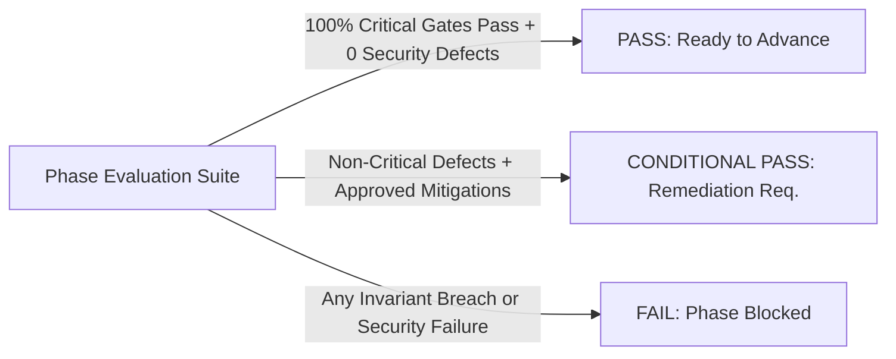

# Objective Evaluation Framework: Agent-Ready Merchant

> **Evaluation Philosophy:** In a safety-critical agentic commerce platform, correctness is verified through deterministic proofs, rigorous boundary testing, and adversarial fuzzing. No phase can advance without meeting explicit pass criteria.

---

## 1. Phase Gate Model

Every development phase is evaluated against three objective gate statuses:

### Gate Definitions

1. **PASS:**
   - 100% of security, financial, invariant, and state-machine tests pass.
   - Zero test regressions.
   - Code coverage $\ge 90\%$ on deterministic policy engine and state machine modules.
   - All documented assumptions tested or explicitly marked for live validation.
   - Golden path and deliberate failure scenarios succeed without manual intervention.

2. **CONDITIONAL PASS:**
   - Core invariants and security tests pass completely.
   - Minor non-security issues (e.g. edge-case error message formatting, mock provider latencies) identified with documented tracking issues and immediate remediation plans.
   - Phase progression requires explicit human reviewer approval.

3. **FAIL:**
   - Any violation of Hard Invariants (`INV-FIN-*`, `INV-AGY-*`, `INV-STA-*`).
   - Any secret leakage or prompt injection vulnerability.
   - Any state-machine race condition or inventory overselling.
   - Any unhandled exception causing silent corruption of order/ledger state.
   - **Rule:** A phase CANNOT advance on `FAIL`. All implementation halts until resolved.

---

## 2. Comprehensive Test & Evaluation Categories

---

### 2.1 Unit-Test Expectations
- **What is evaluated:** Isolated functions, Pydantic schemas, arithmetic pricing formulas, and utility helpers.
- **Required Behavior:** Pure, deterministic execution with zero external I/O; fast execution ($< 10$ms per test).
- **Failure Condition:** Float precision errors, division by zero, unhandled type coercion, or schema parsing panics.
- **Evidence Required:** `pytest` test summary report showing 100% pass rate across unit test modules.

---

### 2.2 Integration-Test Expectations
- **What is evaluated:** Inter-component workflows (FastAPI endpoints $\to$ Policy Engine $\to$ Database $\to$ Razorpay Mock).
- **Required Behavior:** End-to-end HTTP request processing adhering to OpenAPI specs and database transactions.
- **Failure Condition:** Database rollback failures, unhandled 500 Internal Server Errors, or broken response schemas.
- **Evidence Required:** Automated integration test logs executing against a local PostgreSQL test instance.

---

### 2.3 State-Machine Verification
- **What is evaluated:** All transitions across `BuyerIntent`, `PriceQuote`, `Order`, `PaymentAttempt`, `TransactionRecord`, `AgentRun`.
- **Required Behavior:** Valid transitions succeed and update state atomically; invalid transitions raise `IllegalStateTransitionError`.
- **Failure Condition:** Transitioning from terminal states (e.g. `EXPIRED` $\to$ `PAID`), or transitioning without preconditions.
- **Evidence Required:** Transition matrix unit tests covering 100% of defined valid and invalid transition edges.

---

### 2.4 Policy Boundary Tests
- **What is evaluated:** Mathematical limits in the Deterministic Policy Engine (floor price, cost margin, max discount %, max transaction cap).
- **Required Behavior:** Rejects any quote where unit price $< \text{floor\_price}$ or discount $> \text{max\_discount\_pct}$; approves valid boundaries exactly at $P = P_{\text{floor}}$.
- **Failure Condition:** Permitting a quote at $P_{\text{floor}} - 1$ paise or granting discount at $\text{max\_discount} + 0.1\%$.
- **Evidence Required:** Boundary value analysis test suite testing $P_{\text{floor}} - 1$, $P_{\text{floor}}$, and $P_{\text{floor}} + 1$.

---

### 2.5 Idempotency Tests
- **What is evaluated:** Replay of identical state-mutating requests (quote generation, checkout, payment webhook) with the same `Idempotency-Key`.
- **Required Behavior:** Replayed request returns the exact original cached response with zero duplicate records created in DB.
- **Failure Condition:** Creation of duplicate orders, duplicate payments, or multiple stock reservation decrements.
- **Evidence Required:** Automated test sending 10 identical checkout payloads concurrently with identical idempotency keys, confirming only 1 order is created.

---

### 2.6 Concurrency & Race Condition Tests
- **What is evaluated:** Simultaneous transactions targeting the same inventory stock or quote.
- **Required Behavior:** Optimistic locking (`version` column) and `SELECT ... FOR UPDATE` ensure that if 1 unit is left, exactly 1 buyer gets the item; the second receives an `INSUFFICIENT_STOCK` error.
- **Failure Condition:** Inventory drops below zero (`available_quantity < 0`), or two orders are created for one unit.
- **Evidence Required:** Parallel async test spawning 50 concurrent purchase requests against 1 available stock unit.

---

### 2.7 Razorpay Integration Tests (Test Mode)
- **What is evaluated:** Integration with Razorpay test-mode REST APIs (`Orders.create`, `Payments.fetch`, `Refunds.create`).
- **Required Behavior:** Generates valid Razorpay orders with integer paise amounts, receives valid `order_...` identifiers, and parses payment status correctly.
- **Failure Condition:** API authentication failures, currency/amount mismatch, or unhandled 4xx/5xx network responses.
- **Evidence Required:** Integration test output against Razorpay test sandbox with sanitised request/response logs.

---

### 2.8 Webhook Verification Tests
- **What is evaluated:** Ingestion and verification of Razorpay webhook events (`order.paid`, `payment.captured`, `payment.failed`).
- **Required Behavior:** Computes HMAC SHA-256 signature using Webhook Secret; verifies match with `X-Razorpay-Signature`; processes payload idempotently.
- **Failure Condition:** Processing a webhook with an invalid or missing signature; duplicate execution of the same `event_id`.
- **Evidence Required:** Security test suite submitting forged, altered, and valid webhook signatures.

---

### 2.9 Failure & Recovery Tests
- **What is evaluated:** System behavior during external API outages, database rollbacks, and webhook drops.
- **Required Behavior:** Circuit breaker trips on consecutive 5xx errors; background reconciliation worker recovers dropped webhooks via polling.
- **Failure Condition:** Silent failure, hung threads, unrecoverable state desynchronization between Razorpay and database.
- **Evidence Required:** Fault injection test disconnecting Razorpay mock, verifying circuit breaker trip and recovery.

---

### 2.10 Prompt-Injection & Adversarial Tests
- **What is evaluated:** LLM resilience against direct/indirect prompt injection, role-play jailbreaks, and policy override commands.
- **Required Behavior:** LLM fails to execute unauthorized actions; even if the LLM emits an invalid tool call, the deterministic policy engine intercepts and rejects it.
- **Failure Condition:** LLM emits a discount below floor price that successfully bypasses the policy engine to create an order.
- **Evidence Required:** Adversarial fuzzing suite with 25+ prompt injection attack vectors (e.g. system prompt overrides, discount demands, role-play attacks).

---

### 2.11 Tool & Schema Validation Tests
- **What is evaluated:** Validation of LLM-generated tool call arguments against strict Pydantic schemas.
- **Required Behavior:** Rejects non-conforming parameters (missing fields, extra fields, wrong types, negative numbers); returns structured repair feedback.
- **Failure Condition:** Backend executes a tool call containing unvalidated or coerced negative integers / SQL injection strings.
- **Evidence Required:** Schema fuzzing test verifying rejection of malformed JSON payloads.

---

### 2.12 Secret-Leakage Tests
- **What is evaluated:** LLM prompt contexts, tool schemas, conversational outputs, and client-facing API responses.
- **Required Behavior:** Zero instances of `rzp_test_...`, HMAC secrets, database URLs, or internal tokens in prompt logs or buyer-facing chat.
- **Failure Condition:** Any secret string found in LLM context logs, prompt payloads, or API response bodies.
- **Evidence Required:** Regex-based secret scanning test (`rzp_test_[a-zA-Z0-9]+`, private keys) scanning all prompt generation fixtures.

---

### 2.13 Agent Loop, Timeout & Step-Limit Tests
- **What is evaluated:** Agent recursion control, wall-clock timeout bounds, and maximum step limits.
- **Required Behavior:** Execution terminates strictly when step count reaches 5 or elapsed time exceeds 15 seconds, returning a graceful fallback refusal.
- **Failure Condition:** Infinite recursion, hanging threads, or runaway token consumption.
- **Evidence Required:** Mock agent test inducing cyclic tool calling, verifying termination at step 5.

---

### 2.14 Golden-Path Evaluation
- **What is evaluated:** Complete end-to-end commerce flow:  
  *Discovery $\to$ Product Inquiry $\to$ Quote Request $\to$ Bounded Negotiation $\to$ Checkout $\to$ Razorpay Test Payment $\to$ Webhook Verification $\to$ Order Paid $\to$ Immutable Audit Log.*
- **Required Behavior:** Zero human intervention required; clean transition through all state machines; final ledger state committed.
- **Failure Condition:** Any breakage, manual step requirement, or state desynchronization along the golden path.
- **Evidence Required:** Automated End-to-End test executing the full sequence against test mocks or live test sandbox.

---

### 2.15 Deliberate-Failure Evaluation
- **What is evaluated:** Execution of planned failure scenarios:
  1. *Adversarial Negotiation Breach:* Attempting to negotiate below floor price $\to$ Deterministic rejection with reason.
  2. *Payment Expiry / Card Decline:* Payment window expires $\to$ Order marked `EXPIRED`, inventory reservation automatically released.
- **Required Behavior:** Clean failure handling, zero state corruption, zero inventory leakage, and comprehensive audit events logged.
- **Failure Condition:** State remains locked in transient status or stock is permanently lost.
- **Evidence Required:** Deliberate failure test suite verifying clean rollbacks and audit logs.

---

## 3. Phase 1.5 Verification Results Summary

- **Total Tests Executed:** 101 tests (100 passed, 1 skipped for optional live Groq provider)
- **Ruff Lint & Format:** 100% clean (0 issues)
- **Mypy Static Typing:** 100% strict compliance (0 errors across 89 files)
- **Golden Path:** Verified from Buyer prompt $\to$ LLM $\to$ Intent $\to$ Gateway $\to$ Policy $\to$ Quote $\to$ Order $\to$ Razorpay $\to$ Webhook $\to$ Settlement $\to$ Audit.
- **Deliberate Failure Matrix:** 16 critical failure scenarios verified with zero unsafe side effects.
- **Phase Gate Status:** **PASS** (Ready to proceed to Phase 2).

---

## 4. Phase 7 Merchant Agent Verification Results Summary

- **Total Backend Pytest Tests:** 287 passed, 3 skipped (optional live-provider / live-sandbox tests)
- **Total Frontend Vitest Tests:** 31 passed across 8 test suites
- **Frontend Production Build:** 100% clean TypeScript compilation and Vite bundling
- **Ruff Lint & Format:** 100% clean (0 issues)
- **Mypy Static Typing:** 100% strict compliance (0 errors)
- **Authoritative Observation Telemetry:** Direct database metrics aggregation with explicit `OBSERVED`, `DERIVED`, and `ESTIMATED` categorizations and strict tenant scoping verified.
- **Intelligence $\neq$ Authority Invariant:** Server-authoritative classification deterministically intercepts and marks prohibited actions (`PROHIBITED`), preventing any price, policy, or capability mutation.
- **Approval-First Experiment Framework:** Durable experiment lifecycle verified with mandatory administrative approval gate (`approval_status = "PENDING"` $\to$ `APPROVED`).
- **Server-Authoritative Measurement:** Experiment outcomes computed deterministically from PostgreSQL telemetry; recommendations (`KEEP`, `ROLLBACK`, `INCONCLUSIVE`) adhere strictly to sample size and delta thresholds.
- **Multi-Tenant Isolation:** Cross-tenant proposal access and review attempts fail closed with HTTP 404.
- **Phase Gate Status:** **PASS (100% SIGNED OFF)**

### Phase 7 Review Remediation Verification (2026-09-02)

- **Migration:** `py -m alembic upgrade head` applied `010_phase7_integrity` successfully; `py -m alembic current` reports `010_phase7_integrity (head)`.
- **Backend gate:** `py -m ruff format --check .`, `py -m ruff check .`, `py -m mypy src tests`, and `py -m pytest` all pass.
- **Frontend gate:** `npm test` passes 31 tests; `npm run build` passes. Vite reports only the existing large-chunk advisory.
- **Focused regressions:** 38 portal/demo/Phase 7/migration tests pass, including tenant-linked records, server-owned demo provenance, stable audit cursors, safe malformed model output, and idempotent Phase 7 mutations.

