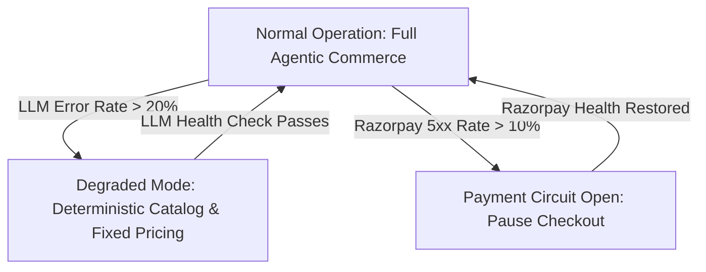
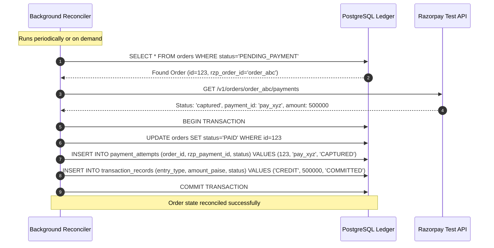

# Failure Model & Safe Recovery Architecture: Agent-Ready Merchant

> **Core Doctrine:** In a distributed financial architecture, failure is not an anomaly; it is an expected operating condition. Every failure must fail closed, preserve ledger integrity, and provide deterministic recovery paths.

---

## 1. Failure Taxonomy & Recovery Matrix

| Failure Mode | Root Cause | Immediate System Behavior | Recovery / Self-Healing Mechanism | Ledger & Financial Impact |
|---|---|---|---|---|
| **LLM Provider Outage** | Groq 503 / Rate Limit / Timeout | Agent runtime catches timeout / exception; aborts run safely | Fallback to deterministic catalog browse; notifies buyer to retry | Zero financial impact. No order created. |
| **Malformed LLM Output** | Non-JSON response or broken schema | Schema validator rejects; increments retry counter | Retry with structured error feedback (max 2); fail with graceful user message | Zero state change. |
| **Policy Violation** | LLM proposes price below floor | Policy engine intercepts and raises policy rejection | Returns deterministic reason to LLM; LLM explains floor to buyer | Zero state mutation. |
| **Razorpay API Outage** | Razorpay REST endpoint 5xx or connection timeout | Payment creation fails with typed `RazorpayTimeoutError` / `RazorpayAPIError` | Order remains in `PENDING_PAYMENT` until retry or expiration | No payment captured. Order remains open until expiry. |
| **Dropped Webhook** | Network partition between Razorpay & server | Order remains in `PENDING_PAYMENT` | Out-of-band reconciliation worker polls `GET /v1/orders/{id}/payments` | Order transitions to `PAID` once verified via polling. |
| **Duplicate Webhook** | Razorpay retries webhook delivery | Webhook receiver checks existing `PaymentAttempt` and `Order` status | Returns HTTP 200 `DUPLICATE_IGNORED`; ignores duplicate event | Zero duplicate state transition or transaction record. |
| **Tampered Webhook** | Forged signature or corrupted payload | Constant-time HMAC SHA-256 verification fails | Rejects with HTTP 400 `InvalidWebhookSignatureError` | Zero state change. Unverified payload rejected. |
| **Payment Amount Mismatch** | Tampered payment payload (fraud attempt) | PaymentService verifies payment amount == order amount | Raises `AmountMismatchFraudError`, leaves order unpaid | Zero credit created. Potential fraud prevented. |
| **Inventory Oversell Race** | Two buyers checkout last stock simultaneously | Optimistic lock detects `version` mismatch | First transaction commits; second transaction receives `OptimisticLockError` | Inventory never drops below 0. Second buyer gets clean refusal. |
| **Merchant Agent LLM Outage** | Groq provider 5xx or timeout during optimization turn | `MerchantAgentService` catches exception; logs warning | Gracefully degrades to raw authoritative observation snapshot without proposals | Zero financial/catalog mutation. Audit event logged. |
| **Merchant Agent Malformed JSON** | Model generates unparseable proposal syntax | Service catches JSON parsing error; returns empty proposals | Returns structured diagnostic empty list; prompts user to re-run | Zero state change. |
| **Hallucinated Proposal Evidence** | Model invents metric names not in snapshot | Server evidence validator rejects the diagnosis/proposal | No unrelated telemetry is substituted; only snapshot-backed findings can persist | Preserves telemetry integrity. |
| **Adversarial Proposal Injection** | Buyer query injects malicious instruction into telemetry | Server-authoritative governance classifier evaluates proposal | Intercepts prohibited keywords/actions (`PROHIBITED`), rejects proposal immediately | Zero policy mutation or capability escalation. |
| **Structured Prohibited Action** | An LLM proposal or experiment variation encodes a financial/policy action in fields such as `action` | Deterministic governance inspects structured action fields independently of declared proposal type | Rejects the proposal or experiment variation as `PROHIBITED` | Zero financial, policy, or capability mutation. |
| **Incomplete Experiment Window** | Merchant requests measurement before the fixed post-approval window has closed | Experiment remains `APPROVED`; no result or recommendation is persisted | Return a deterministic validation error; evaluate only matching fixed baseline and post windows | Prevents misleading `KEEP` or `ROLLBACK` decisions. |
| **Duplicate Phase 7 Mutation** | Browser/network retries review or experiment POST after uncertain delivery | Endpoint claims a merchant-scoped idempotency receipt before applying the state transition | Duplicate request replays the committed response; conflicting reuse fails closed | No duplicate experiment, review, approval, audit event, or result. |
| **Unsafe Demo SKU** | Caller supplies a live or unknown SKU to the simulator | Requested SKU is rejected before demo seeding or settlement | Only canonical server-marked sandbox products may be selected | Production inventory and policies remain unchanged. |
| **Cross-Tenant Proposal Access** | Merchant Beta requests/reviews Alpha's proposal | Server enforces `merchant_id == proposal.merchant_id` | Returns HTTP 404 NOT FOUND; fails closed | Strict multi-tenant isolation preserved. |

---

## 2. Circuit Breakers & Degradation Modes

### 2.1 LLM Circuit Breaker
If the LLM provider fails $\ge 5$ consecutive times within a 60-second sliding window:
1. Circuit opens to `DEGRADED`.
2. Conversational agent is replaced by a deterministic keyword search and fixed-price catalog response.
3. Merchant alerts logged to audit stream.

### 2.2 Payment Gateway Circuit Breaker
If Razorpay API calls return 5xx for $\ge 3$ consecutive transactions:
1. Circuit opens to `PAYMENT_PAUSED`.
2. New checkout attempts are temporarily refused with `PAYMENT_SERVICE_MAINTENANCE`.
3. Background health probe tests `GET /v1/orders` every 30 seconds until healthy.

---

## 3. Reconciliation Engine & Compensation Sagas

