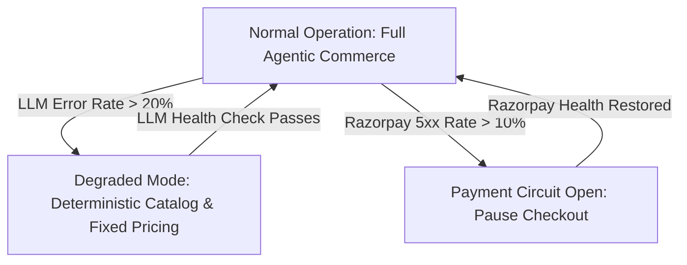
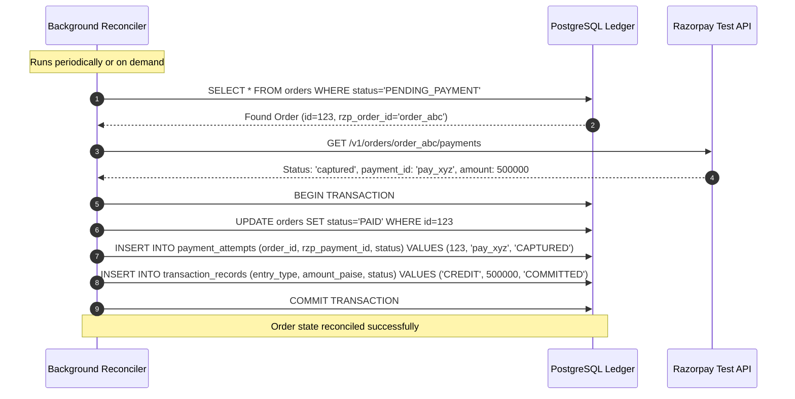

# Failure Model & Safe Recovery Architecture: Agent-Ready Merchant

> **Core Doctrine:** In a distributed financial architecture, failure is not an anomaly; it is an expected operating condition. Every failure must fail closed, preserve ledger integrity, and provide deterministic recovery paths.

---

## 1. Failure Taxonomy & Recovery Matrix

| Failure Mode | Root Cause | Immediate System Behavior | Recovery / Self-Healing Mechanism | Ledger & Financial Impact |
|---|---|---|---|---|
| **LLM Provider Outage** | Groq 503 / Rate Limit / Timeout | Agent runtime catches timeout / exception; aborts run safely | Fallback to deterministic catalog browse; notifies buyer to retry | Zero financial impact. No order created. |
| **Malformed LLM Output** | Non-JSON response or broken schema | Schema validator rejects; increments retry counter | Retry with structured error feedback (max 2); fail with graceful user message | Zero state change. |
| **Policy Violation** | LLM proposes price below floor | Policy engine intercepts and raises policy rejection | Returns deterministic reason to LLM; LLM explains floor to buyer | Zero state mutation. |
| **Razorpay API Outage** | Razorpay REST endpoint 5xx or connection timeout | Payment creation fails with typed `RazorpayTimeoutError` / `RazorpayAPIError` | Order remains in `PENDING_PAYMENT` until retry or expiration | No payment captured. Order remains open until expiry. |
| **Dropped Webhook** | Network partition between Razorpay & server | Order remains in `PENDING_PAYMENT` | Out-of-band reconciliation worker polls `GET /v1/orders/{id}/payments` | Order transitions to `PAID` once verified via polling. |
| **Duplicate Webhook** | Razorpay retries webhook delivery | Webhook receiver checks existing `PaymentAttempt` and `Order` status | Returns HTTP 200 `DUPLICATE_IGNORED`; ignores duplicate event | Zero duplicate state transition or transaction record. |
| **Tampered Webhook** | Forged signature or corrupted payload | Constant-time HMAC SHA-256 verification fails | Rejects with HTTP 400 `InvalidWebhookSignatureError` | Zero state change. Unverified payload rejected. |
| **Payment Amount Mismatch** | Tampered payment payload (fraud attempt) | PaymentService verifies payment amount == order amount | Raises `AmountMismatchFraudError`, leaves order unpaid | Zero credit created. Potential fraud prevented. |
| **Inventory Oversell Race** | Two buyers checkout last stock simultaneously | Optimistic lock detects `version` mismatch | First transaction commits; second transaction receives `OptimisticLockError` | Inventory never drops below 0. Second buyer gets clean refusal. |
| **Merchant Agent LLM Outage** | Groq provider 5xx or timeout during optimization turn | `MerchantAgentService` catches exception; logs warning | Gracefully degrades to raw authoritative observation snapshot without proposals | Zero financial/catalog mutation. Audit event logged. |
| **Merchant Agent Malformed JSON** | Model generates unparseable proposal syntax | Service catches JSON parsing error; returns empty proposals | Returns structured diagnostic empty list; prompts user to re-run | Zero state change. |
| **Hallucinated Proposal Evidence** | Model invents metric names not in snapshot | Server evidence validator rejects the diagnosis/proposal | No unrelated telemetry is substituted; only snapshot-backed findings can persist | Preserves telemetry integrity. |
| **Adversarial Proposal Injection** | Buyer query injects malicious instruction into telemetry | Server-authoritative governance classifier evaluates proposal | Intercepts prohibited keywords/actions (`PROHIBITED`), rejects proposal immediately | Zero policy mutation or capability escalation. |
| **Structured Prohibited Action** | An LLM proposal or experiment variation encodes a financial/policy action in fields such as `action` | Deterministic governance inspects structured action fields independently of declared proposal type | Rejects the proposal or experiment variation as `PROHIBITED` | Zero financial, policy, or capability mutation. |
| **Hidden Structured Prohibited Action** | An LLM places a prohibited command beneath a neutral metadata label | Deterministic governance normalizes structured values and matches explicit command forms | Rejects the proposal as `PROHIBITED` before persistence | Neutral key names cannot downgrade risk; benign commerce terms remain reviewable. |
| **Incomplete Experiment Window** | Merchant requests measurement before the fixed post-approval window has closed | Experiment remains `APPROVED`; no result or recommendation is persisted | Return a deterministic validation error; evaluate only matching fixed baseline and post windows | Prevents misleading `KEEP` or `ROLLBACK` decisions. |
| **Late Conversion Settlement Bias** | A quote settles after its observation endpoint or an order is updated later for fulfillment | Conversion cohorts use append-only committed credit records created by each matching endpoint | Later settlement affects a future observation, while later order updates cannot erase a conversion | Baseline and post windows have matching settlement maturity. |
| **Duplicate Phase 7 Mutation** | Browser/network retries review or experiment POST after uncertain delivery | Endpoint claims a merchant-scoped idempotency receipt before applying the state transition | Duplicate request replays the committed response; conflicting reuse fails closed | No duplicate experiment, review, approval, audit event, or result. |
| **Unsafe Demo SKU** | Caller supplies a live or unknown SKU to the simulator | Requested SKU is rejected before demo seeding or settlement | Only canonical server-marked sandbox products may be selected | Production inventory and policies remain unchanged. |
| **Cross-Tenant Proposal Access** | Merchant Beta requests/reviews Alpha's proposal | Server enforces `merchant_id == proposal.merchant_id` | Returns HTTP 404 NOT FOUND; fails closed | Strict multi-tenant isolation preserved. |

---

## 2. Circuit Breakers & Degradation Modes



### 2.1 LLM Circuit Breaker
If the LLM provider fails $\ge 5$ consecutive times within a 60-second sliding window:
1. Circuit opens to `DEGRADED`.
2. Conversational agent is replaced by a deterministic keyword search and fixed-price catalog response.
3. Merchant alerts logged to audit stream.

### 2.2 Payment Gateway Circuit Breaker
If Razorpay API calls return 5xx for $\ge 3$ consecutive transactions:
1. Circuit opens to `PAYMENT_PAUSED`.
2. New checkout attempts are temporarily refused with `PAYMENT_SERVICE_MAINTENANCE`.
3. Background health probe tests `GET /v1/orders` every 30 seconds until healthy.

---

## 3. Reconciliation Engine & Compensation Sagas



---

## 4. Controlled Autonomy Failure Modes & Recovery Sagas

### 4.1 Master Kill Switch Trigger Saga
```mermaid
sequenceDiagram
    autonumber
    participant Admin as Merchant Admin
    participant Service as ControlledAutonomyService
    participant DB as PostgreSQL
    participant Audit as AuditEvent Ledger

    Admin->>Service: POST /autonomy/kill-switch (enabled=True, reason)
    Service->>DB: UPDATE merchants SET kill_switch_enabled=TRUE, version=version+1
    Service->>Audit: Append AUTONOMY_KILL_SWITCH_TOGGLED
    Service->>DB: SELECT * FROM merchant_experiments WHERE status='RUNNING'
    loop For each running experiment
        Service->>DB: UPDATE merchant_experiments SET status='STOPPED', stopping_condition['stopped_by_kill_switch']=TRUE
        Service->>Audit: Append MERCHANT_EXPERIMENT_STOPPED
    end
    Service->>DB: COMMIT TRANSACTION
    Note over Service,DB: All pending autonomous runs blocked; all active experiments safely halted
```

### 4.2 Optimistic Lock Version Conflict Failure
- **Trigger:** Concurrent modification of target product/experiment by merchant human editor or concurrent worker between proposal formulation and autonomous execution.
- **Handling:** Target version check `WHERE id = :target_id AND version = :expected_version` detects conflict.
- **Resolution:** Transaction aborts immediately with `OptimisticLockError`. No domain mutation occurs, no ledger record is persisted, and request fails closed safely.

### 4.3 Deterministic Rollback Conflict Rejection (Human Precedence)
- **Trigger:** A human merchant modified the target product description or tags *after* an autonomous action was executed (`target.version > action.target_version_after`).
- **Handling:** `rollback_action` checks whether the target entity was modified by an intervening human transaction.
- **Resolution:** Rollback fails closed with `RollbackConflictError`. The action remains `EXECUTED` while its `rollback_status` transitions to `CONFLICT_REJECTED`, preserving the human merchant's edits without clobbering.

### 4.4 Rate Limit, Quota & Cooldown Exhaustion
- **Trigger:** Excessive autonomous executions attempting to exceed configured hourly limits (`hourly_count >= max_executions_per_hour`), daily limits (`daily_count >= max_executions_per_day`), or cooldown window (`elapsed < cooldown_seconds`).
- **Handling:** Server queries committed ledger records in past 1 hour and 1 day.
- **Resolution:** Rejects request fail-closed with `AutonomyExecutionError` detailing exhausted quota or remaining cooldown seconds. State remains unmutated.

### 4.5 Rollback Conflict Idempotency Completion
- **Trigger:** A delegated experiment rollback encounters a target changed by a newer human merchant edit.
- **Handling:** The action-rollback and experiment-stop operations each persist a terminal `CONFLICT_REJECTED` receipt before the endpoint commits the conflict audit event and returns HTTP 409.
- **Resolution:** Same-key retries deterministically return the terminal conflict rather than an indefinite "in progress" response. No target state is overwritten.

### 4.6 High Failure Anomaly Circuit Breaker
- **Trigger:** 3 or more autonomous execution failures occur within the trailing 1-hour window.
- **Handling:** Each rejected execution gate or optimistic-lock conflict rolls back its nested execution transaction, then appends a tenant-scoped `merchant_autonomy_failures` record and immutable `AUTONOMOUS_ACTION_REJECTED` audit event. `evaluate_anomaly_state` counts these durable records over the trailing hour.
- **Resolution:** Subsequent autonomous execution attempts fail closed with `REQUIRE_HUMAN_REVIEW` while the rolling failure threshold is met. The state is intentionally derived rather than persisted, so it returns to `NORMAL` only after all qualifying failure records age out of the one-hour window.

---

## 5. Discovery Network Failure Modes

### 5.1 Anti-Probing & Non-Discoverable Merchant Lookup Rejection (Uniform 404)
- **Trigger:** An external buyer agent, aggregator crawler, or malicious actor attempts a direct lookup (`GET /api/v1/discovery/merchants/{public_id}`) on a merchant ID that is non-existent, or currently in `PRIVATE`, `PAUSED`, or `SUSPENDED` state.
- **Handling:** `DiscoveryService.get_public_merchant_by_id_or_slug` queries the store profile. If missing or not `DISCOVERABLE`, it immediately raises `MerchantNotFoundError`.
- **Resolution:** Returns an identical HTTP 404 response (`MERCHANT_NOT_FOUND`, "Merchant not found or not discoverable.") with uniform timing and payload. The probing caller cannot distinguish whether the merchant ID exists or is non-public.

### 5.2 Out-of-Band Stock Depletion After Discovery (Transaction-Time Inventory Gate)
- **Trigger:** Discovery search reports a product as "in stock" based on coarse metadata. Between discovery and order creation, inventory drops to zero (due to concurrent purchases or merchant admin adjustment).
- **Handling:** Discovery data is explicitly non-binding. When the buyer agent attempts to accept a quote or create an order via `CanonicalCommerceGateway.create_order`, the gateway locks the inventory row (`SELECT ... FOR UPDATE`) and validates live unreserved stock against the requested quantity.
- **Resolution:** Fails closed with `ORDER_CREATION_FAILED` ("Insufficient stock for variant..."). Zero orders or payment charges are committed, and inventory remains non-negative (`INV-STA-03`).

### 5.3 Unauthorized Discovery Publication Attempt by Autonomous Agent
- **Trigger:** An autonomous merchant agent or external caller attempts to call `PUT /api/v1/merchant/discoverability` to change store status to `DISCOVERABLE` or alter discovery tags.
- **Handling:** `DiscoveryService.update_discoverability` enforces an explicit actor check: `actor_role == "MERCHANT_ADMIN"`.
- **Resolution:** Rejects the call immediately with `DiscoverySecurityError` (HTTP 403). Autonomous agents and non-admin actors are structurally prevented from publishing merchants or altering public visibility.

### 5.4 Public Search Rate-Limit Saturation
- **Trigger:** A buyer agent, scraper, or bot sends more than 60 discovery search requests within a rolling 60-second window from the same client IP address.
- **Handling:** `DiscoveryService.search_merchants` checks the client IP against an in-memory sliding window deque of request timestamps.
- **Resolution:** Rejects excess requests with `DiscoveryRateLimitError` (HTTP 429: "Discovery search rate limit exceeded. Please retry in a few moments."). System compute and database query capacity remain protected.

### 5.5 Replay of Duplicate Discovery Search Telemetry
- **Trigger:** A network retry or aggregator re-transmits an identical search telemetry event (`SEARCH_RECEIVED`, `MERCHANT_RETURNED`, etc.) with the same `correlation_id`.
- **Handling:** `DiscoveryService.record_telemetry` catches `IntegrityError` on the composite unique index `(merchant_id, event_type, correlation_id)` in `merchant_discovery_telemetry`.
- **Resolution:** Silently ignores the duplicate insert, rolls back the sub-transaction savepoint, and logs a debug event. Telemetry metrics remain accurate without duplicate inflation.

### 5.6 Bounded Discovery Search and Handoff Retry
- **Trigger:** A public caller requests a broad discovery search or retries a handoff after losing the first response.
- **Handling:** Discovery evaluates one deterministic cursor page (at most 50 merchant candidates and 20 public product summaries per merchant) and returns a continuation cursor when more candidates remain. Handoff claims a merchant-scoped durable idempotency receipt before session creation.
- **Resolution:** Broad requests cannot load an unbounded merchant result set. A matching handoff replay returns the original session identifier without minting another session or replaying a server-generated raw buyer token.


