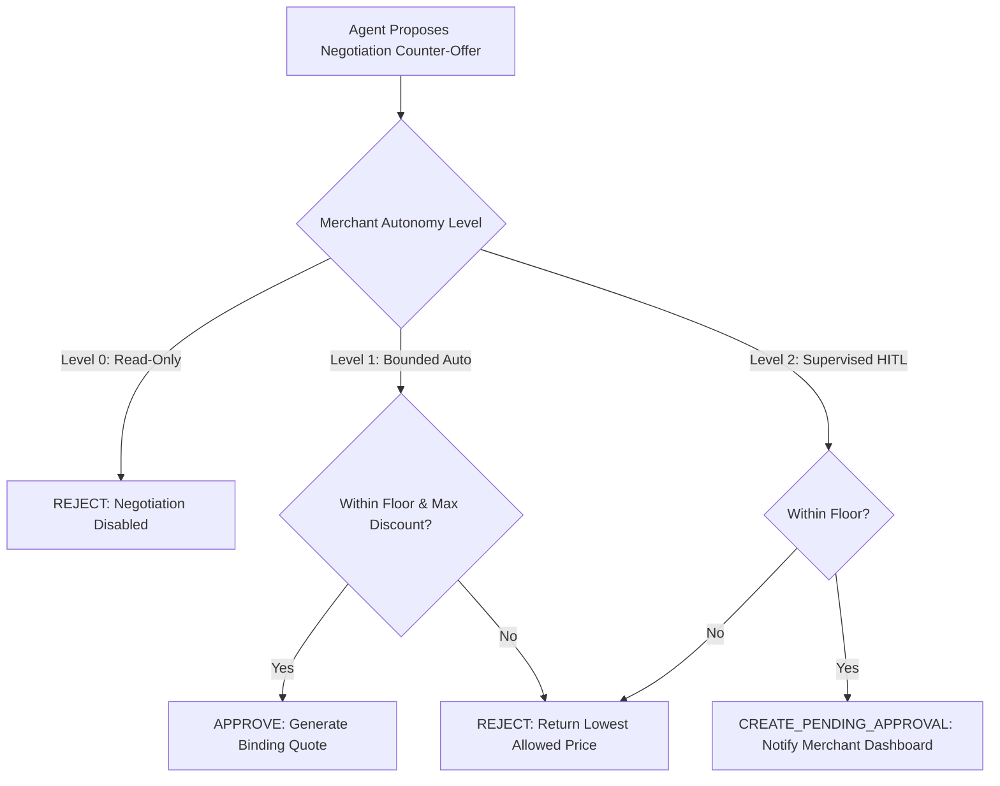

# Deterministic Policy Model: Agent-Ready Merchant (Phase 0)

> **Core Doctrine:** Policies are deterministic mathematical boundaries and boolean predicates evaluated strictly in application code. The LLM has zero ability to bypass, relax, or reconfigure policies. When policies conflict, the system fails closed (most restrictive rule applies).

---

## 1. Policy Hierarchy & Evaluation Flow

```
+-----------------------------------------------------------------------------------+
|                           INCOMING AGENT PROPOSAL                                 |
+-----------------------------------------+-----------------------------------------+
                                          |
                                          v
+-----------------------------------------------------------------------------------+
| 1. GLOBAL PLATFORM SAFETY POLICIES (Hardcoded, Non-Configurable)                  |
|    - Max single transaction: <= ₹1,00,000 (10,000,000 paise)                     |
|    - Max items per order: <= 20 units                                             |
|    - Anti-Negative Price Guard: Price must be strictly > 0 paise                  |
+-----------------------------------------+-----------------------------------------+
                                          |
                                          v
+-----------------------------------------------------------------------------------+
| 2. MERCHANT-LEVEL POLICIES (Configured in DB by Merchant Admin)                   |
|    - Merchant Autonomy Level (Level 0: Read-Only, Level 1: Bounded, Level 2: HITL)|
|    - Global Max Discount % (e.g. 15.0%)                                          |
|    - Global Minimum Margin % (e.g. 20.0% above Cost of Goods Sold)                |
|    - Daily AI-influenced Transaction Volume Limit (e.g. ₹5,00,000/day)            |
+-----------------------------------------+-----------------------------------------+
                                          |
                                          v
+-----------------------------------------------------------------------------------+
| 3. CATEGORY / PRODUCT-SPECIFIC POLICIES                                           |
|    - SKU Floor Price (`product.floor_price_paise`)                                |
|    - SKU Negotiation Flag (`product.is_negotiable == true`)                       |
|    - Safety Stock Reserve Threshold (Hold back X units from AI buyers)            |
+-----------------------------------------+-----------------------------------------+
                                          |
                                          v
+-----------------------------------------------------------------------------------+
| 4. DETERMINISTIC EVALUATION VERDICT                                               |
|    - [PASS] -> Proceed to Action Gateway                                          |
|    - [FAIL] -> Return Structured Error to LLM (Reject Proposal)                   |
|    - [ESCALATE] -> Route to Merchant Approval Queue (HITL)                        |
+-----------------------------------------------------------------------------------+
```

---

## 2. Policy Specifications

### 2.1 Pricing & Negotiation Bounds

#### A. Floor Price Enforcement
For any proposed item unit price $P_{\text{proposed}}$:
$$P_{\text{proposed}} \ge \max(P_{\text{floor}}, P_{\text{cost}} \times (1 + M_{\text{min}}))$$
- $P_{\text{floor}}$: Hardcoded SKU floor price in paise.
- $P_{\text{cost}}$: Cost of goods sold.
- $M_{\text{min}}$: Minimum acceptable margin fraction (e.g., $0.15$).

#### B. Maximum Discount Cap
For any order-level discount $D_{\text{total}}$:
$$D_{\text{total}} \le S_{\text{subtotal}} \times D_{\text{max\_pct}}$$
- $S_{\text{subtotal}}$: Undiscounted line-item sum.
- $D_{\text{max\_pct}}$: Configured max discount percentage (e.g., $0.20$ for 20%).

---

### 2.2 Rate & Financial Volume Limits

| Level | Parameter | Default MVP Limit | Enforcement Action |
|---|---|---|---|
| **Buyer Session** | Tool calls per minute | 20 calls/min | HTTP 429 Too Many Requests |
| **Buyer Session** | Negotiation attempts per quote | 3 attempts | Lock quote at last valid offer |
| **Merchant** | Single transaction cap | ₹50,000 (5,000,000 paise) | Require Merchant Approval (HITL) |
| **Merchant** | 24-Hour AI Transaction Volume | ₹5,00,000 (50,000,000 paise) | Trip circuit breaker to Level 0 |

---

### 2.3 Shipping & Delivery Rules

- **Eligible Regions:** India (IN) postal codes only in test mode.
- **Free Shipping Threshold:** Orders with `subtotal_paise >= 100000` (₹1,000) receive free shipping; otherwise, flat ₹100 (10,000 paise) is added.
- **P.O. Box & Restricted Zones:** Automatically rejected by policy filter.

---

### 2.4 Cancellation & Refund Rules

- **Pre-Payment Cancellation:** Permitted freely at any time prior to payment capture. Stock reservation is immediately released.
- **Post-Payment Cancellation:** Permitted only within 60 minutes of payment if order is in `PAID` state and not yet `FULFILLED`. Automatically generates a Razorpay test refund.

---

### 2.5 Merchant Autonomy Configuration Matrix



---

## 3. Policy Conflict Resolution Algorithm

When multiple policy rules evaluate against a single quote or order:

1. **Fail-Closed Principle:** If any rule explicitly evaluates to `REJECT`, the entire action is rejected.
2. **Most Restrictive Bound Wins:**
   - Floor price: $\max(P_{\text{floor\_sku}}, P_{\text{floor\_category}}, P_{\text{floor\_merchant}})$
   - Max discount: $\min(D_{\text{pct\_sku}}, D_{\text{pct\_category}}, D_{\text{pct\_merchant}})$
3. **No Dynamic Code Injection:** Policies are evaluated via static AST-based parameter checks or pure arithmetic comparison functions.
