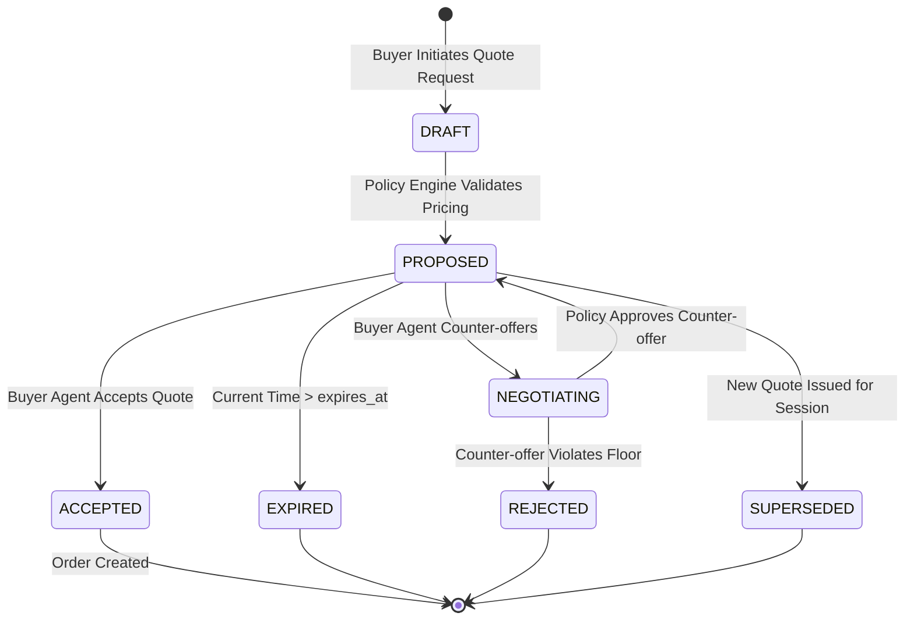
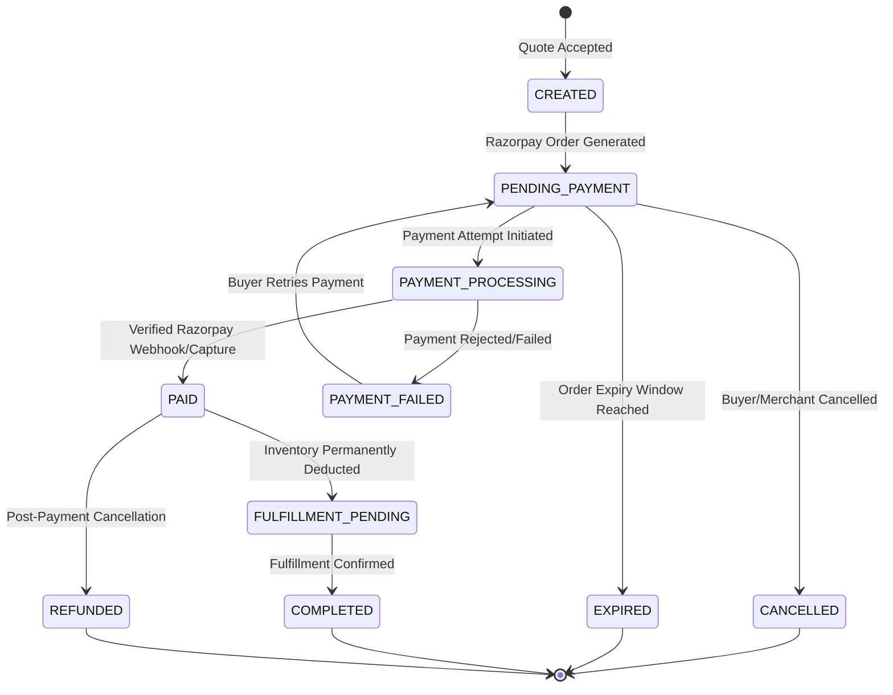
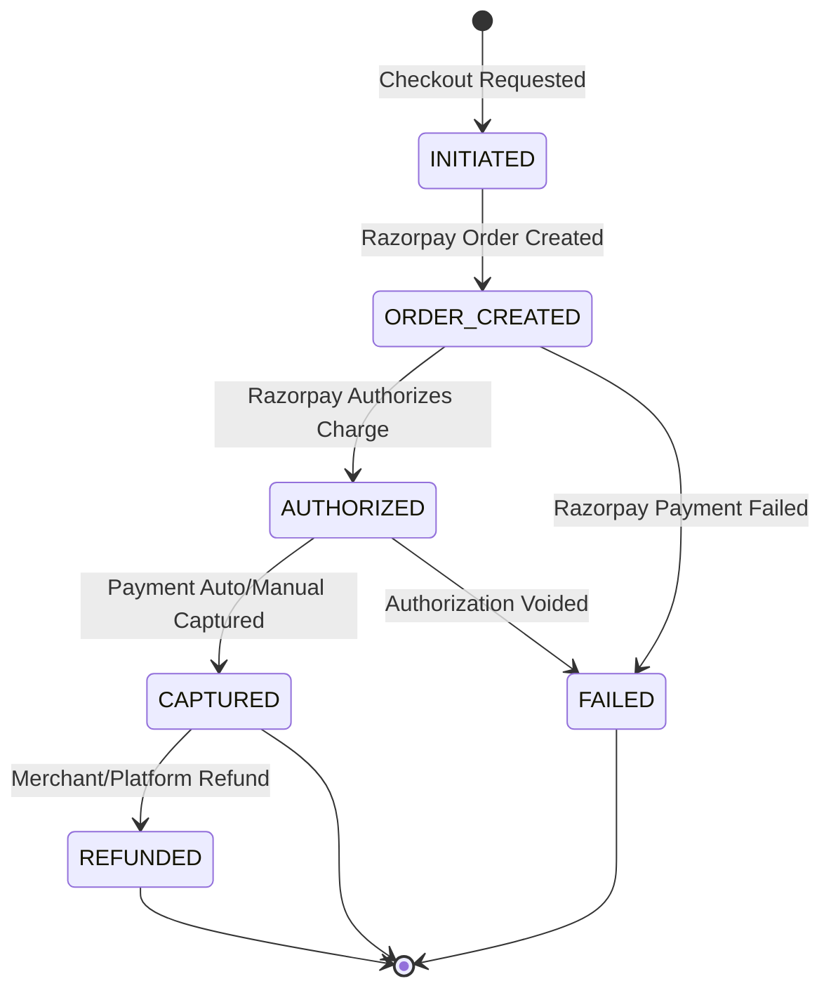
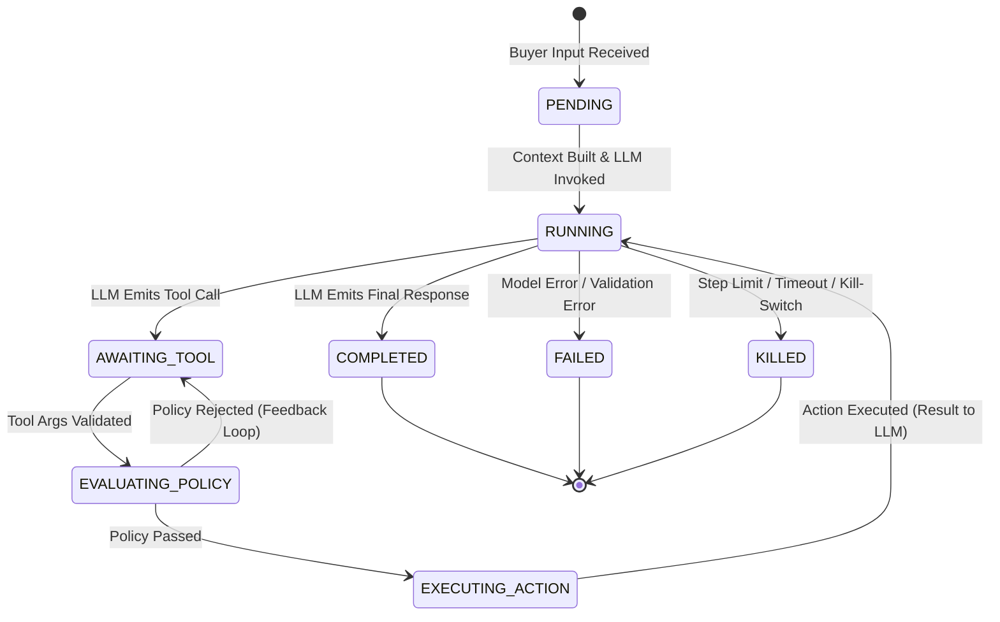
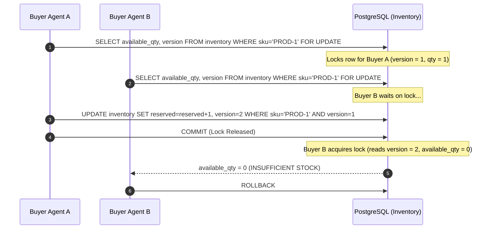

# Authoritative State Machines: Agent-Ready Merchant (Phase 0)

> **Core Doctrine:** State transitions are strictly server-authoritative. The LLM can never write directly to state columns. Every transition is validated by a finite state machine (FSM) backed by PostgreSQL transactional locks and optimistic versioning.

---

## 1. Overview of State Machines

The platform manages six distinct, decoupled state machines:
1. **BuyerIntent FSM:** Tracks buyer intent parsing and validation.
2. **PriceQuote FSM:** Governs quote creation, bounded negotiation, expiry, and acceptance.
3. **Order FSM:** Manages canonical commerce order progression.
4. **PaymentAttempt FSM:** Tracks Razorpay test-mode payment authorization and capture.
5. **TransactionRecord FSM:** Immutable financial ledger settlement.
6. **AgentRun FSM:** Governs the execution and safety limits of agent steps.

---

## 2. PriceQuote State Machine

A `PriceQuote` represents a merchant's binding, time-limited commercial offer.

### 2.1 State Diagram

### 2.2 Transition Specification Table

| From State | Event / Trigger | To State | Preconditions & Invariants | Side Effects | Idempotency Key |
|---|---|---|---|---|---|
| `[*]` | `REQUEST_QUOTE` | `DRAFT` | Valid product ID, quantity $\ge 1$, session active | Quote record inserted with `expires_at = now() + 15m` | `hash(session_id, items, ts_bucket)` |
| `DRAFT` | `EVALUATE_POLICY` | `PROPOSED` | `subtotal - discount >= floor_price` | Stock tentatively reserved; audit log emitted | `quote_id + "_propose"` |
| `PROPOSED` | `COUNTER_OFFER` | `NEGOTIATING`| Quote not expired; negotiation attempt count $\le 3$ | Lock quote row; evaluate counter-offer price | `hash(quote_id, requested_price)` |
| `NEGOTIATING` | `ACCEPT_COUNTER` | `PROPOSED` | Counter price $\ge$ SKU floor price and discount $\le$ max allowed | Update quote amount; increment negotiation count | `quote_id + "_counter_ok"` |
| `NEGOTIATING` | `REJECT_COUNTER` | `REJECTED` | Counter price $<$ floor price or max discount exceeded | Release any reservation; emit policy rejection | `quote_id + "_counter_fail"` |
| `PROPOSED` | `ACCEPT_QUOTE` | `ACCEPTED` | Current time $\le$ `expires_at`; inventory available | Freeze quote; trigger Order creation | `quote_id + "_accept"` |
| `PROPOSED` | `TIMEOUT` | `EXPIRED` | Current time $>$ `expires_at` | Release stock reservations | `quote_id + "_expire"` |

---

## 3. Order State Machine

The `Order` represents the merchant's authoritative commitment to fulfill goods upon successful payment.

### 3.1 State Diagram

### 3.2 Transition Specification Table

| From State | Event / Trigger | To State | Preconditions & Invariants | Side Effects | Idempotency Key |
|---|---|---|---|---|---|
| `[*]` | `CREATE_FROM_QUOTE` | `CREATED` | Quote in `ACCEPTED` state; inventory reserved | Order row created; line items locked | `order_quote_{quote_id}` |
| `CREATED` | `RZP_ORDER_CREATED` | `PENDING_PAYMENT` | Razorpay API returns `order_id` | `rzp_order_id` saved; expiry timer started (15m) | `rzp_ord_{order_id}` |
| `PENDING_PAYMENT` | `PAYMENT_START` | `PAYMENT_PROCESSING` | Order not expired; `PaymentAttempt` created | Create `PaymentAttempt` row | `pay_attempt_{order_id}` |
| `PAYMENT_PROCESSING` | `PAYMENT_SUCCESS` | `PAID` | Verified HMAC SHA-256 webhook or server fetch | Decrement inventory stock; write `TransactionRecord` | `webhook_{event_id}` |
| `PAYMENT_PROCESSING` | `PAYMENT_FAILURE` | `PAYMENT_FAILED` | Gateway returns failure | Record error; allow retry until order expiry | `fail_{rzp_payment_id}` |
| `PENDING_PAYMENT` | `TIMEOUT` | `EXPIRED` | Current time $>$ `order.expires_at` | Release reserved inventory; mark order dead | `expire_{order_id}` |
| `PENDING_PAYMENT` | `CANCEL` | `CANCELLED` | Order not yet paid | Release inventory reservation | `cancel_{order_id}` |

---

## 4. PaymentAttempt State Machine

Manages individual attempts to satisfy an order via Razorpay test-mode.

### 4.1 State Diagram

### 4.2 Transition Rules & Invariants
- **Authorized to Captured:** In test mode, payments configured for auto-capture transition from `AUTHORIZED` to `CAPTURED` immediately upon webhook receipt.
- **Server Authority:** The client callback (`razorpay_payment_id`, `razorpay_signature`) is NEVER treated as final until verified via server HMAC computation or direct Razorpay REST fetch (`GET /v1/payments/{payment_id}`).
- **Amount Immutability:** The amount verified in `PaymentAttempt` must match `Order.amount_paise` exactly. A mismatch throws a security exception and transitions state to `FAILED_FRAUD_DETECTED`.

---

## 5. AgentRun State Machine

Controls the execution loop of the untrusted intelligence agent to prevent runaway recursion and prompt leaks.

### 5.1 State Diagram

### 5.2 Agent Execution Limits
- **Max Steps:** $\le 5$ tool executions per buyer turn.
- **Run Timeout:** $\le 15$ seconds total execution wall-clock time.
- **Max Policy Retries:** $\le 2$ policy rejections before the run terminates with a standard fallback refusal.

---

## 6. Concurrent Modification & Race Resolution

